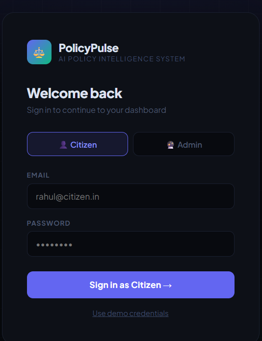
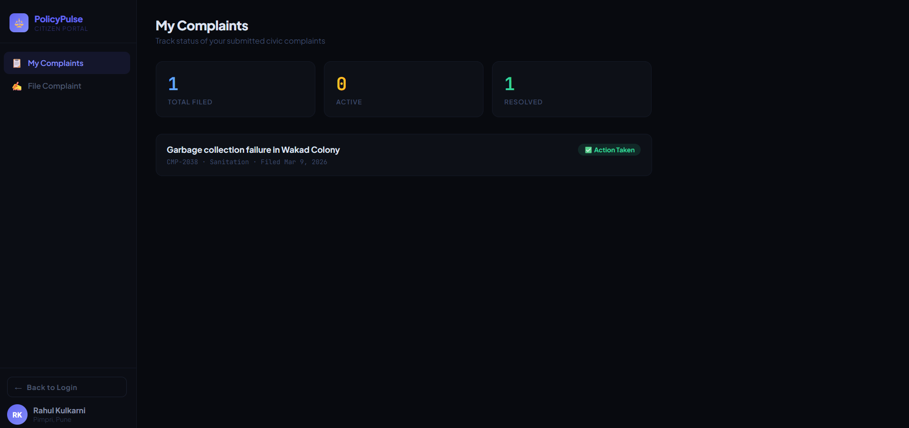
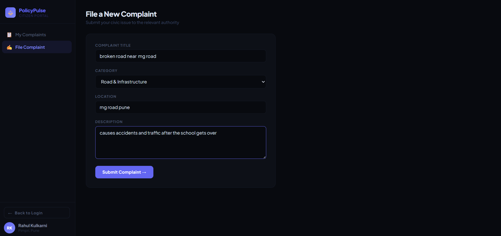
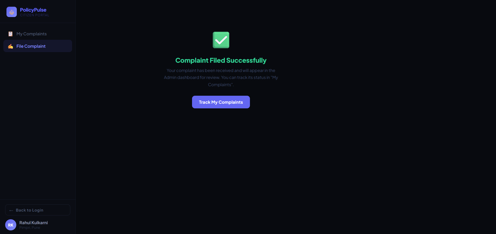
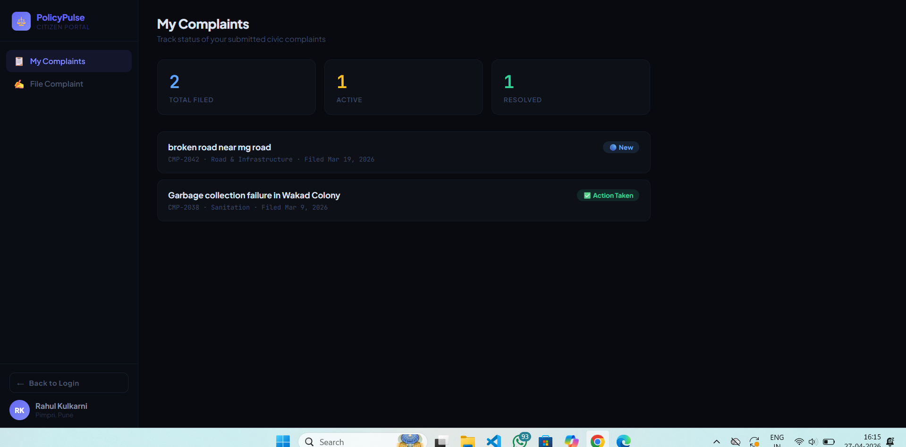
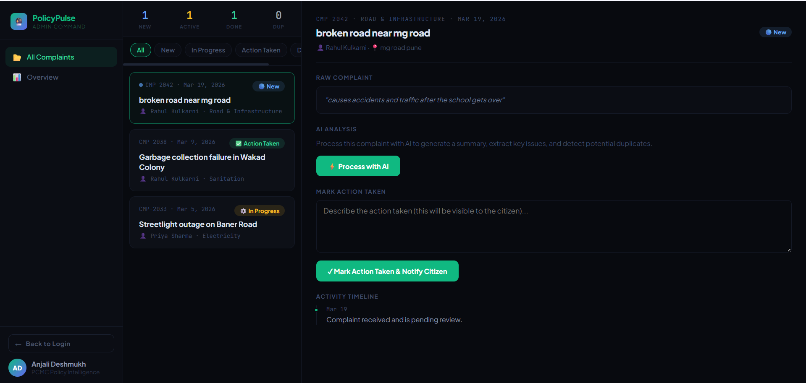
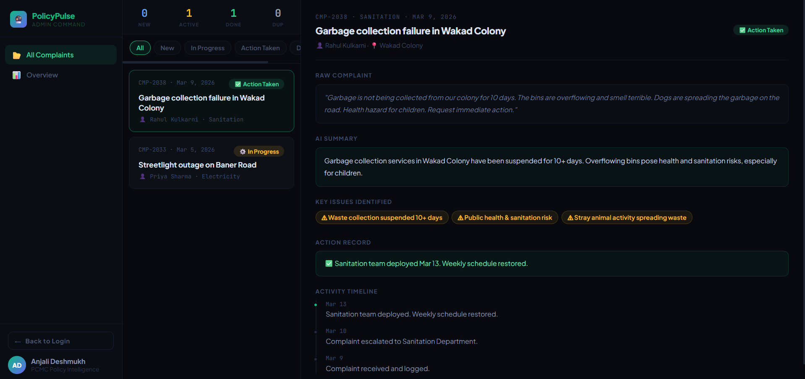

# ⚖️ PolicyPulse — AI-Based Policy Intelligence & Complaint Management System

> A smart civic complaint management system — 
> bridging the gap between citizens and government authorities.

---

## 🎯 Problem Statement

Civic complaint systems in India are broken.
- Citizens file complaints and never hear back
- Admins are overwhelmed with repetitive, poorly written complaints
- No transparency, no tracking, no intelligence layer
- Duplicate complaints waste time and resources

**PolicyPulse solves all of this.**

---

## ✨ Features

### 👤 Citizen Portal
- 🔐 Secure role-based login
- 📝 File complaints with category, location and description
- 📋 Track only YOUR complaints — not everyone else's
- 📊 Real-time status updates — New, In Progress, Action Taken
- 🕐 Full activity timeline for every complaint
- 👀 See action notes written by admin

### 🔮 Admin Command Center
- 📂 View all complaints filed by citizens in real time
- ⚡ AI-powered complaint processing — summary + key issues
- 🔗 Duplicate detection and merging
- ✅ Mark action taken with notes (visible to citizen instantly)
- 📊 Overview analytics dashboard
- 🔍 Filter complaints by status

### 🤖 AI Intelligence Layer
- Reads raw unstructured complaint text
- Generates clean 2-3 sentence summary
- Extracts key issues automatically
- Returns structured JSON for seamless integration

---

## 🛠️ Tech Stack

| Technology | Purpose |
|---|---|
| React JS | Component-based UI framework |
| JavaScript (ES6+) | Core programming language |
| Anthropic Claude API | AI complaint processing |
| CSS3 | Styling and animations |
| Google Fonts | Typography (Plus Jakarta Sans, JetBrains Mono) |
| REST API + Fetch | Claude API communication |
| Node.js + NPM | Local development environment |

---

## 🏗️ Project Structure
policy-pulse/
├── src/
│   ├── App.jsx          # Entire application — all components
│   └── index.js         # React entry point
├── public/
│   └── index.html       # Base HTML shell
├── package.json         # Dependencies and scripts
└── README.md
##Link to directly access the portfolio 
https://pbl-pulse.netlify.app/ 

##Portfolio 

